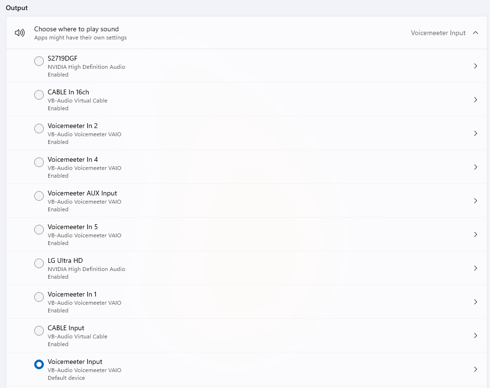
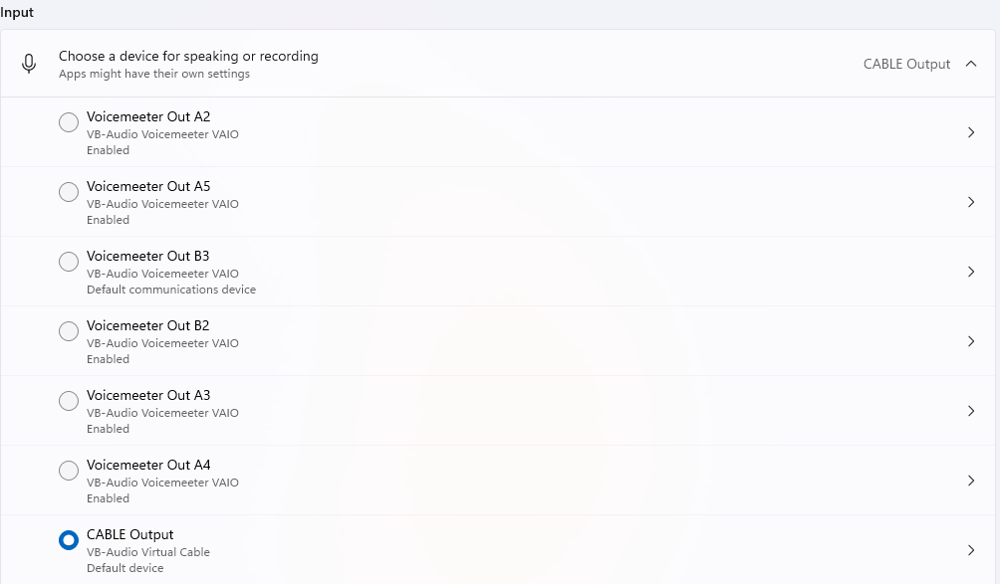

# Live Japanese Transcription

This project transcribe live Japanese audio and display them in a window.

## Features

- The audio can be anything played on PC, e.g., youtube, media player, etc.
- Kanji in the transcription is annotated with hiragana.
- Translation to English is appended after each sentence.

## Requirements
### Windows
- [VB-Audio Virtual Cable](https://vb-audio.com/Cable/) is needed to route the system audio to virtual mic
- [Voicemeeter](https://vb-audio.com/Voicemeeter/) is needed, if you want to output the system audio to both the virtual mic and a real speaker.

### MacOS
- [BlackHole](https://existential.audio/blackhole/) is needed as a virtual audio driver

## Installation

```
pip install -r requirements.txt
## Download vosk models
## small model
curl -L -o vosk-model-small-ja-0.22.zip https://alphacephei.com/vosk/models/vosk-model-small-ja-0.22.zip
## large model
curl -L -o vosk-model-ja-0.22.zip https://alphacephei.com/vosk/models/vosk-model-ja-0.22.zip
unzip vosk-model-ja-0.22.zip
mv vosk-model-ja-0.22 model-ja
```

## System Setup

### Windows
Set the sound output to be Voicemeeter Input


Set the sound input to be CABLE Output


In voice meeter, set one output to be the real speaker, and the other to be CABLE Input


### MacOS
Create a multi-output device using Audio MIDI setup. Assign one output to BlackHole 2ch, and the other to the desired speaker or headphone.


Set sound output to the created multi-output device


Set sound input to Blackhole 2ch


## Usage 
There are two scripts recommended, using different technologies.
1. Using OPENAI whisper
```
python live_trans.py
```


2. Using VOSK 
```
python live_tran_vosk_translation.py
```